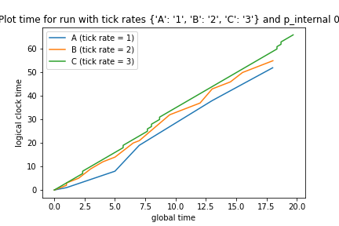

# Logical Clocks Lab Notebook
Students: Kayla Huang and Tom Cobley

While working on this, keep a lab notebook in which you note the design decisions you have made. Then, run the scale model at least 5 times for at least one minute each time. Examine the logs, and discuss (in the lab book) the size of the jumps in the values for the logical clocks, drift in the values of the local logical clocks in the different machines (you can get a god’s eye view because of the system time), and the impact different timings on such things as gaps in the logical clock values and length of the message queue. Observations and reflections about the model and the results of running the model are more than welcome.

Once you have run this on three virtual machines that can vary their internal times by an order of magnitude, try running it with a smaller variation in the clock cycles and a smaller probability of the event being internal. What differences do those variations make? Add these observations to your lab notebook. Play around, and see if you can find something interesting.

You may use whatever packages or support code for the construction of the model machines and for the communication between the processes. 

---

# Model Machine Decisions
Our model relies primarily on two classes ModelMachine in model_machine.py, which calls the rudimentary LogicalClock class in logical_clock.py. The logical clock contains only two functions—one to update to a new logical clock time given by the callee and one to simply increment the current internal self.time attribute of the logical clock.

Meanwhile, in creating ModelMachine, we decided to implement peer to peer connections as opposed to connecting to a central server. This is in an effort to eliminate problems when we continue to scale up from three machines to many, many more. In that setting, it is more efficient to have peer to peer connections. 

We chose not to use pipes for the reasons outlined in class—it is not as scaleable—and because the former specifications noted to use sockets. We also did not use any global data structures because it added issues relating to managing concurrency and we did not feel the need to add this unnecessary convolution as everything was modularized thoroughly through ModelMachine. 

## Listening and Sending
Listening and sending messages are done in the same way as in the last pset—we use simple sockets to communicate between the two machines. This means that there are three connections open in total (and, as a result, three port numbers needed), one between each of the pairs of the three machines. This also means that, in any machine, there are two connections made (two for each of the connections to the other machines).

## Cycles and Ticks
In regards to the self.cycle() function, the ModelMachine waits for global_time_ms() - self.last_tick_time > 1000 / self.ticks_ps to be true as opposed to waiting for a modulo to be matched. This is because the exact instance at which the ms matches the tick benchmark might be missed, so we want to check duration as opposed to checking the raw global time. 

## Queues
The collections.deque() queue was used for this implementation, though we recognize that a double ended queue is not strictly necessary. This was mostly for fun. Deque is, after all, a superset of the queue data structure in python. We used a package for simplicity, though we could have easily just implemented a simply queue from scratch. 

## Testing Decisions
In terms of testing, we mainly used asserts throughout the model_machine.py and logical_clock.py files. 

---

# Analysis

## P=0.7 Case
For the base case of P(internal event) = 0.7, we ran five different tests using three different machines each. We fed in tick rates for the following five experiments and let the system run for one minute each:

| Experiment # | A tick rate | B tick rate | C tick rate |
| --- | --- | --- | --- |
| i | 1 | 1 | 1 |
| ii | 1 | 2 | 3 |
| iii | 1 | 3 | 6 |
| iv | 3 | 4 | 5 |
| v | 4 | 5 | 6 |

The results for the logical clock divergence in these five cases, when plotted against the global time, can be seen in the plots.ipynb file. There, we also observe the differences in message queue length and time drift when varying the tick rate parameters. 

## General Results

### 20 seconds and logical clock drift
For the P=0.7 case, we see very generally that, when tick values vary greatly (i.e. 1, 3, and 6) the machine with low tick rate (1 tick per second, in this case) experiences quite a large drift from the other machines. See the result below for just twenty seconds of run time:

Meanwhile, when the tick rates are set to be somewhat closer (i.e. 1, 2, 3), this drift, as expected, does not happen as much

no matter what the average tick rate is,i.e. when we use 4, 5, 6 instead. However, in this case, the spread is obviously thinner because there are so many more ticks from each machine:

We see this even less when the tick rates are exactly the same, though nothing is perfect:

### 60 seconds
As the run time increases, we can also see some interesting patterns with the queue length (as well see that our findings from the above section are only magnified when the machines are run for the entire minute).

#### Clock Drift
The most interesting result regarding timing is from the 1, 3, 6 test case. We can see below that the drift from the first machine (with 1 tick per second) has the absolute largest drift. 

At the end of the 60 seconds, machine A has a logical clock time of 235 while B and C have 404 and 406, respectively. This is a drift of (405-235 / 405) about 42%. This is astronomical, especially as this system scales. Meanwhile, if we take a look at the 4, 5, 6 case (clocks that tick relatively frequently but still are slightly different), we see:

The final numbers come out to 384, 380, and 386, respectively (for machines A, B, and C). Not bad!

#### Queue Length
When looking at the queues, the result from 1, 3, 6 is again the most interesting:

The first, slower machine suffers greatly because it is so slow at digesting from its own queue and the other machines are so fast to send new messages. This explains the drift in time synchonization. 

Meanwhile, for the other cases, we don't see any of the same issues:

---

## Different Internal Event Probabilities

### Testing P=0.3
When the probability of an internal event is significantly smaller (i.e. 0.3), we see some markedly different results. In running three experiments, we see the following drifts in times:

Again, we cut the graph short at 20 seconds so we can actually see what is going on with the first and third cases. Then, taking a look at the middle case, which is the interesting one, at 60 seconds:

and has final results of 154, 420, 438 for A, B, and C, respectively. From the average of 429, the drift away at 154 is 64%. Unsurprisingly, the lower the probability of internal events, the higher the logical time drift is. 

Now, looking at the queue lengths:

